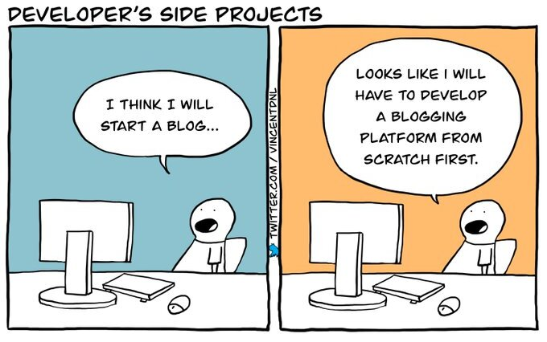

# Yonei.dev fullstack blog

A Python application designed to serve as a feature rich personal blogging framework.

It parses Markdown files organized into numbered folders to generate an easy
navigable list of articles.  
Thanks to the power of [**FastAPI**][fastapi] and various [**Markdown addons**][1],
it simplifies the process of building and managing blogs.

This app also provides optional database integration for storing article views,
Prometheus metrics for monitoring, [**hot reloading**][2] for efficient
development and an interactive article listing thanks to the use of the
[**HTMX JavaScript framework**][htmx].

[1]: https://gitlab.com/yonei.dev/fullstack/-/blob/main/pyproject.toml#L19
[2]: https://github.com/florimondmanca/arel

### ⚠ DISCLAIMER
This project is far from perfect, it has some flaws and caveats. I advise you to not run
it in production untill a major stable release is pushed `(v1.x.x or higher)`  
For more information on what is and is not implemented, please refer to the documentation or
the [roadmap](#-roadmap) section of this readme.

# ✨ Features

- **Markdown-Based Articles**: Easily manage articles in Markdown format, making backup and migration a breeze.

- **Frontmatter Metadata**: Categorize articles, display informative titles, and sort content by date, author, and more.

- **Seamless Article Navigation:** [HTMX][htmx]-powered list of articles on the homepage for smooth reader navigation.

- (Optional) **Database Integration**: Store and retrieve article view metrics securely using cookie sessions, ensuring user privacy.

- **Prometheus Metrics**: Monitor server performance, request/response stats, and website health for valuable insights.

- **Hot Reloading**: Swiftly iterate with real-time updates to Markdown files and the codebase, streamlining writing and development.

## ❓ Why(s)

- ### Why did i make this?
    This project was started in order to "test my skills in the field" and also
    serve as a personal blogging platform for myself, later i decided to make app
    accessable to anyone.  
    Maybe this meme will describe the situation the best:  
    

- ### Why use HTMX as a JS Framework instead of an industry standard?
    `Popular != Good`. [HTMX][htmx] is fast and lightweight. There is abosulutely no reason to spin
    up a whole node server to serve simple interactivity *(in this case just a postlist and
    cookie banner)*, htmx has all the nescessary tools to ship a feature rich app.

# 🚀 Quickstart
To get started with the blog app, see the **Getting started** section of the
app [documentation][docs] or follow the steps below or :

1. Make sure you have `docker`, `docker-compose` and `git` installed *(optionally `python` and `poetry`)*

2. Clone this repository

3. Copy the `.env.example` file to `.env` and edit nescessary settings

4. Edit some Markdown files in the designated `posts` folder. Utilize the frontend metadata to enhance the user experience.

5. If you want to configure the database settings to store article view metrics. Refer to the provided [documentation][docs] for instructions on how to set up and connect to your database.

6. Build and run the app
    1. If you prefer `poetry`:
        ```sh
        poetry install
        poetry run python main.py
        ```

    2. If you prefer `docker`:
        ```sh
        docker compose up
        ```
        *(**Note**: add the `-d` flag to start in the background)*

7. Access the platform in your browser at `https://localhost:port`, the port being:
    - **If docker**: The port specified in the `docker-compose.yml` file (default external is 8080)
    - **If poetry**: The `APP_PORT` variable in the `.env` file

# 📋 Roadmap

- General
    - [x] Documentation
    - [ ] Use npm for dependencies
    - [ ] Makefile for simplicity
    - [ ] Rate limiting (toggled with ENV variable)
    - [ ] Better article folder structure instead of numbered folders
    - [ ] Example setups with reverse proxies (Traefik, Nginx)
    - [ ] Custom logger both for uvicorn and regular logs
    - [ ] Use a TOML config to configure internal app settings
- Code optimizations and improvements
    - Tests
        - [ ] Proper unit tests
        - [ ] Code coverage integration
        - [ ] Dont a mock database, better split the logic
    - [ ] Improve the Database logic
    - [ ] Make the app fully asynchronous
    - [ ] Use a SSG solution for generating articles instead of parsing markdown on request
- Frontend
    - [ ] Darkmode
    - [ ] Proper style guide & a sane theme

# 🤝 Contributing

Contributions are welcome! If you encounter any issues, have suggestions for improvements, or would like to add new features to the app, please open an issue or submit a pull request.

# 🧾 License

The app is open-source and released under the [**MIT License**](LICENSE).

[docs]: https://yonei-dev.gitlab.io/fullstack/
[htmx]: https://htmx.org
[fastapi]: https://fastapi.tiangolo.com
